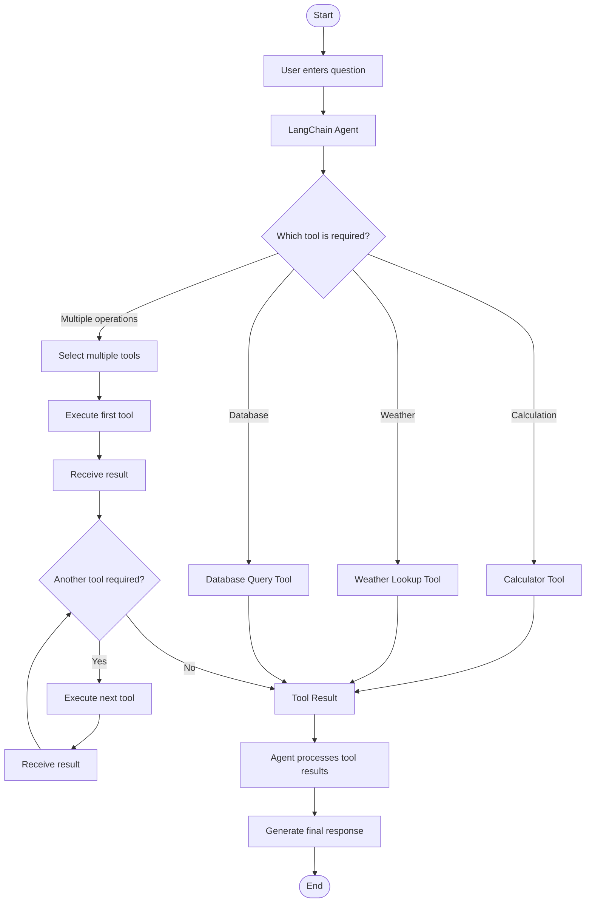

# Custom AI Tools Agent

A LangChain-based AI agent that can intelligently select and use custom tools to answer user questions.

This project demonstrates how an agent can decide whether it needs a **calculator**, **weather lookup**, or **database query** tool, and how it can combine multiple tools when a question requires more than one operation.

---

## Project Overview

The agent receives a natural-language question and determines which tool or tools are required to answer it.

### Available Tools

1. **Calculator Tool**

   * Performs mathematical calculations.
   * Example: `125 * 48`

2. **Weather Lookup Tool**

   * Returns simulated weather information for a city.
   * Example: `What is the weather in Bangalore?`

3. **Database Query Simulator**

   * Simulates querying employee information.
   * Example: `Find employee 102.`

The agent can also use **multiple tools in a single request**.

### Example

```text
User:
What is the weather in Bangalore and convert its temperature to Fahrenheit?

        ↓

Agent
        ↓
Weather Lookup
        ↓
28°C
        ↓
Calculator
        ↓
82.4°F
        ↓
Final Answer
```

---

# Architecture

```text
                         ┌───────────────────┐
                         │    User Question  │
                         └─────────┬─────────┘
                                   │
                                   ▼
                         ┌───────────────────┐
                         │   LangChain Agent │
                         └─────────┬─────────┘
                                   │
                    ┌──────────────┼──────────────┐
                    │              │              │
                    ▼              ▼              ▼
             ┌────────────┐ ┌────────────┐ ┌──────────────┐
             │ Calculator │ │  Weather   │ │   Database   │
             │    Tool    │ │ Lookup Tool│ │ Query Tool   │
             └─────┬──────┘ └─────┬──────┘ └──────┬───────┘
                   │              │               │
                   └──────────────┼───────────────┘
                                  │
                                  ▼
                         ┌───────────────────┐
                         │    Tool Result    │
                         └─────────┬─────────┘
                                   │
                                   ▼
                         ┌───────────────────┐
                         │   Final Answer    │
                         └───────────────────┘
```

---

# Classic Agent Flowchart

The following flowchart represents the complete execution flow.



---

# Multi-Tool Flow

One of the most important features of this project is that the agent can use **more than one tool for the same question**.

For example:

```text
User:
What is the weather in Bangalore and convert its temperature to Fahrenheit?
```

The execution can be represented as:

```text
                  ┌──────────────────────────┐
                  │ User Question            │
                  │ Weather + Conversion     │
                  └────────────┬─────────────┘
                               │
                               ▼
                     ┌──────────────────┐
                     │   LangChain      │
                     │      Agent       │
                     └────────┬─────────┘
                              │
                              ▼
                     ┌──────────────────┐
                     │ Weather Tool     │
                     └────────┬─────────┘
                              │
                              ▼
                           28°C
                              │
                              ▼
                     ┌──────────────────┐
                     │ Calculator Tool  │
                     │ (°C → °F)        │
                     └────────┬─────────┘
                              │
                              ▼
                          82.4°F
                              │
                              ▼
                     ┌──────────────────┐
                     │   Final Answer   │
                     └──────────────────┘
```

This demonstrates that an AI agent is not limited to calling a single tool. It can perform a **tool-use loop** and use the output of one tool as input for another operation.

---

# Concepts Demonstrated

This project demonstrates several important LangChain and agent concepts.

### 1. LangChain Tools

Tools provide external capabilities that the language model cannot reliably perform by itself.

Examples:

```text
Calculator
Weather Lookup
Database Query
```

---

### 2. Custom Tools

The project creates custom functions and exposes them to the agent as tools.

Conceptually:

```python
@tool
def calculator(expression: str):
    ...
```

The function becomes available to the agent as a tool.

---

### 3. `@tool` Decorator

LangChain's `@tool` decorator allows a Python function to be exposed as a tool.

Example:

```python
from langchain.tools import tool

@tool
def calculator(expression: str) -> str:
    """Perform a mathematical calculation."""
    ...
```

The function's description is important because the agent uses the tool metadata to determine when the tool should be selected.

---

### 4. Tool Descriptions

Tool descriptions help the agent understand the purpose of each tool.

For example:

```python
@tool
def weather_lookup(city: str) -> str:
    """Get the current weather information for a city."""
    ...
```

The agent can infer that:

```text
"What is the weather in Delhi?"
```

should use:

```text
weather_lookup
```

rather than:

```text
calculator
```

---

### 5. Agent Tool Selection

The agent analyzes the user's question and determines which tool is appropriate.

Example:

```text
"What is 125 * 48?"

        ↓

Calculator Tool
```

Another example:

```text
"Find employee 102."

        ↓

Database Query Tool
```

---

### 6. ReAct-Style Tool Use

The project demonstrates the same fundamental idea as the classic ReAct agent pattern:

```text
Question
   ↓
Think / Determine Action
   ↓
Call Tool
   ↓
Observe Result
   ↓
Determine Next Action
   ↓
Call Another Tool (if necessary)
   ↓
Final Answer
```

The implementation uses the **current LangChain agent API** rather than the older `AgentExecutor` / `create_react_agent` approach.

---

# Current LangChain API

Older LangChain tutorials frequently use:

```python
AgentExecutor
```

and:

```python
create_react_agent
```

Current LangChain documentation uses:

```python
create_agent
```

as the main agent harness.

This project uses:

```python
create_agent
```

so that the implementation follows the modern LangChain API while still demonstrating the same fundamental agent/tool execution loop.

---

# Example Tool Selection

The agent can make decisions similar to the following:

| User Question                                                    | Tool                  |
| ---------------------------------------------------------------- | --------------------- |
| `What is 250 / 5?`                                               | Calculator            |
| `What is 125 * 48?`                                              | Calculator            |
| `What is the weather in Bangalore?`                              | Weather               |
| `What is the temperature in Delhi?`                              | Weather               |
| `Find employee 102.`                                             | Database              |
| `Tell me about Rahul.`                                           | Database              |
| `Which employees are in Engineering?`                            | Database              |
| `Weather in Bangalore and convert the temperature to Fahrenheit` | Weather + Calculator  |
| `Find employee 103 and calculate 10% of their salary.`           | Database + Calculator |

---

# Demo 1 — Calculator

### Input

```text
You: What is 125 * 48?
```

### Expected Flow

```text
User
 ↓
Agent
 ↓
Calculator
 ↓
6000
 ↓
Final Answer
```

### Expected Result

```text
125 × 48 = 6000
```

---

# Demo 2 — Weather

### Input

```text
You: What is the weather in Bangalore?
```

### Expected Flow

```text
User
 ↓
Agent
 ↓
Weather Lookup
 ↓
28°C, Partly Cloudy
 ↓
Final Answer
```

### Expected Result

```text
The weather in Bangalore is 28°C and Partly Cloudy.
```

---

# Demo 3 — Database

### Input

```text
You: Find employee 102.
```

### Expected Flow

```text
User
 ↓
Agent
 ↓
Database Query
 ↓
Rahul, Data Engineer
 ↓
Final Answer
```

### Expected Result

```text
Employee 102 is Rahul, a Data Engineer.
```

---

# Demo 4 — Multiple Tools

This is the recommended demonstration for showing the project to a manager, reviewer, or interviewer.

### Input

```text
You: What is the weather in Bangalore and convert its temperature to Fahrenheit?
```

### Expected Flow

```text
User
      ↓
LangChain Agent
      ↓
Weather Lookup
      ↓
28°C
      ↓
Calculator
      ↓
82.4°F
      ↓
Final Answer
```

### Expected Result

```text
The temperature in Bangalore is 28°C, which is 82.4°F.
```

### Why This Demo Is Important

This demonstrates that the system is a true **tool-using agent** rather than simply a collection of independent functions.

The agent must:

1. Identify that weather information is required.
2. Call the weather tool.
3. Read the returned temperature.
4. Determine that a calculation is required.
5. Call the calculator.
6. Combine both results.
7. Produce the final response.

---

# Demo 5 — Database + Calculator

### Input

```text
You: Find employee 103 and calculate 10% of their salary.
```

### Expected Flow

```text
User
 ↓
Agent
 ↓
Database Query
 ↓
Employee 103
Salary
 ↓
Calculator
 ↓
10% of Salary
 ↓
Final Answer
```

This demonstrates another multi-tool workflow where the output of the database tool can become information needed for a calculation.

---

# Debugging and Callbacks

A custom callback is included to make the agent's execution visible while it is running.

The callback prints events such as:

```text
TOOL START
TOOL INPUT
TOOL OUTPUT
TOOL ERROR
```

This is useful for understanding exactly what the agent is doing.

---

## Example Debug Output

A successful calculator execution could look like:

```text
==============================
TOOL START
==============================
Tool: calculator

==============================
TOOL INPUT
==============================
125 * 48

==============================
TOOL OUTPUT
==============================
6000
```

A weather request could produce:

```text
==============================
TOOL START
==============================
Tool: weather_lookup

==============================
TOOL INPUT
==============================
Bangalore

==============================
TOOL OUTPUT
==============================
28°C, Partly Cloudy
```

---

# Error Debugging

If a tool fails, the callback can display:

```text
==============================
TOOL ERROR
==============================
Tool: calculator

Error:
Invalid mathematical expression
```

This makes debugging much easier because you can see:

```text
Which tool was called
        ↓
What input it received
        ↓
What output it produced
        ↓
Whether an error occurred
```

---

# Project Structure

A recommended VS Code structure is:

```text
custom-ai-tools-agent/
│
├── main.py
├── tools.py
├── callbacks.py
├── requirements.txt
├── .env
├── .gitignore
└── README.md
```

Depending on how the project is implemented, you may also organize it as:

```text
custom-ai-tools-agent/
│
├── src/
│   ├── __init__.py
│   ├── agent.py
│   ├── tools.py
│   └── callbacks.py
│
├── main.py
├── requirements.txt
├── .env
├── .gitignore
└── README.md
```

---

# File Responsibilities

## `main.py`

Application entry point.

Responsible for:

* Creating the agent.
* Starting the application.
* Accepting user questions.
* Passing questions to the agent.
* Printing the final response.

---

## `tools.py`

Contains the custom tools.

For example:

```text
calculator
weather_lookup
database_query
```

---

## `callbacks.py`

Contains debugging callbacks used to display:

```text
TOOL START
TOOL INPUT
TOOL OUTPUT
TOOL ERROR
```

---

## `.env`

Stores configuration values such as API keys.

Example:

```env
OPENAI_API_KEY=your_api_key_here
```

Do not commit your `.env` file to Git.

---

## `requirements.txt`

Contains the Python dependencies required by the project.

Example:

```text
langchain
langchain-openai
python-dotenv
```

The exact dependencies may vary depending on the model provider and LangChain version used by the implementation.

---

# Installation

## 1. Clone or create the project

Open the project folder in VS Code.

```bash
cd custom-ai-tools-agent
```

---

## 2. Create a virtual environment

### Windows

```bash
python -m venv .venv
```

Activate it:

```bash
.venv\Scripts\activate
```

### macOS / Linux

```bash
python3 -m venv .venv
```

Activate it:

```bash
source .venv/bin/activate
```

---

## 3. Install dependencies

```bash
pip install -r requirements.txt
```

---

## 4. Configure environment variables

Create a `.env` file:

```env
OPENAI_API_KEY=your_api_key_here
```

Replace the placeholder with your API key.

---

# Running the Project

Start the application with:

```bash
python main.py
```

You should see something similar to:

```text
========================================
       Custom AI Tools Agent
========================================

Available tools:
- Calculator
- Weather Lookup
- Database Query

Enter your question:
```

Then enter a question such as:

```text
What is 125 * 48?
```

---

# Example Session

```text
========================================
       Custom AI Tools Agent
========================================

You: What is 125 * 48?

TOOL START
Tool: calculator

TOOL INPUT
125 * 48

TOOL OUTPUT
6000

Agent: 125 × 48 = 6000.
```

Another example:

```text
You: Find employee 102.

TOOL START
Tool: database_query

TOOL INPUT
102

TOOL OUTPUT
Rahul, Data Engineer

Agent: Employee 102 is Rahul, a Data Engineer.
```

---

# Multi-Tool Example Session

```text
You:
What is the weather in Bangalore and convert its temperature to Fahrenheit?
```

The agent may execute:

```text
TOOL START
Tool: weather_lookup

TOOL INPUT
Bangalore

TOOL OUTPUT
28°C, Partly Cloudy
```

Then:

```text
TOOL START
Tool: calculator

TOOL INPUT
28 * 9 / 5 + 32

TOOL OUTPUT
82.4
```

Finally:

```text
Agent:
The weather in Bangalore is 28°C (Partly Cloudy),
which is equivalent to 82.4°F.
```

---

# Database Simulator

The database tool is a **simulation** rather than a production database connection.

Example simulated records could be:

```text
Employee ID: 101
Name: Priya
Role: Backend Developer

Employee ID: 102
Name: Rahul
Role: Data Engineer

Employee ID: 103
Name: Arjun
Role: Software Engineer
```

The agent can query these records through the custom database tool.

Example:

```text
Find employee 102.
```

Result:

```text
Rahul
Data Engineer
```

---

# Weather Simulator

The weather tool can return predefined or simulated weather information.

Example:

```text
Bangalore → 28°C, Partly Cloudy
Delhi     → 32°C, Sunny
Mumbai    → 29°C, Cloudy
```

This is useful for demonstrating agent behavior without requiring a real external weather API.

---

# Calculator Tool

The calculator is responsible for mathematical operations.

Examples:

```text
250 / 5
125 * 48
10 + 20
28 * 9 / 5 + 32
```

For an agent application, it is preferable to isolate calculation functionality inside a dedicated tool rather than relying on the language model to perform arithmetic itself.

---

# Agent Execution Loop

At a high level, the agent follows this process:

```text
┌──────────────────────┐
│   Receive Question   │
└──────────┬───────────┘
           │
           ▼
┌──────────────────────┐
│ Analyze User Intent  │
└──────────┬───────────┘
           │
           ▼
┌──────────────────────┐
│ Select Appropriate   │
│ Tool                 │
└──────────┬───────────┘
           │
           ▼
┌──────────────────────┐
│ Execute Tool         │
└──────────┬───────────┘
           │
           ▼
┌──────────────────────┐
│ Observe Tool Result  │
└──────────┬───────────┘
           │
           ▼
      ┌────────────┐
      │ More work? │
      └─────┬──────┘
            │
       ┌────┴────┐
       │         │
      Yes        No
       │         │
       ▼         ▼
  Select next   Generate
     tool       final answer
       │         │
       └────┐    │
            │    │
            ▼    ▼
          Repeat  End
```

---

# Why Use an Agent?

A normal application might have to explicitly decide:

```python
if "weather" in question:
    weather_lookup()

elif "calculate" in question:
    calculator()

elif "employee" in question:
    database_query()
```

An agent changes this architecture.

Instead, the language model receives a set of tools and determines which tool is appropriate based on the user's natural-language request.

For example:

```text
"Find employee 103 and calculate 10% of their salary."
```

The application does not need to hard-code:

```text
1. Call database
2. Read salary
3. Call calculator
4. Generate answer
```

The agent can determine that workflow dynamically.

---

# Benefits of This Architecture

### Extensible

Additional tools can be added without fundamentally changing the agent architecture.

For example:

```text
Calculator
Weather
Database
Email
Web Search
File Search
Calendar
```

---

### Natural-Language Interface

Users do not need to know which tool exists.

They can simply ask:

```text
What is the weather in Delhi?
```

instead of explicitly saying:

```text
Call weather_lookup("Delhi")
```

---

### Multi-Step Tasks

The agent can combine multiple tools.

Example:

```text
Database
   ↓
Calculator
   ↓
Final Response
```

or:

```text
Weather
   ↓
Calculator
   ↓
Final Response
```

---

# Limitations

This project is intended for learning and demonstration.

The weather and database components are simulated and should not be treated as production services.

For production usage, consider adding:

* A real weather API.
* A real database connection.
* Input validation.
* Authentication and authorization.
* Tool-level permissions.
* Structured tool inputs.
* Proper error handling.
* Logging.
* Rate limiting.
* Monitoring.
* Guardrails.
* Tests.

---

# Security Considerations

Never hard-code API keys inside Python source code.

Avoid:

```python
api_key = "sk-xxxxxxxx"
```

Use environment variables instead:

```env
OPENAI_API_KEY=your_api_key_here
```

And load them securely from the environment.

Also make sure that `.env` is included in `.gitignore`.

Example:

```gitignore
.venv/
.env
__pycache__/
*.pyc
```

---

# Testing Checklist

Use the following questions to test the agent.

### Calculator

```text
What is 250 / 5?
```

```text
What is 125 * 48?
```

---

### Weather

```text
What is the weather in Bangalore?
```

```text
What is the temperature in Delhi?
```

---

### Database

```text
Find employee 102.
```

```text
Tell me about Rahul.
```

```text
Which employees are in Engineering?
```

---

### Multiple Tools

```text
What is the weather in Bangalore and convert its temperature to Fahrenheit?
```

```text
Find employee 103 and calculate 10% of their salary.
```

---

# Expected Learning Outcomes

After completing this project, you should understand:

* What LangChain tools are.
* How custom tools are created.
* How `@tool` works.
* Why tool descriptions matter.
* How an agent selects tools.
* How an agent can call multiple tools.
* How tool results are returned to the agent.
* How an agent performs iterative tool use.
* How callbacks can be used for debugging.
* How the modern `create_agent` API differs from older agent patterns.

---

# Interview / Manager Demonstration

A good demonstration sequence is:

### 1. Simple tool call

```text
What is 125 * 48?
```

Show:

```text
Agent → Calculator → 6000
```

### 2. Different tool

```text
What is the weather in Bangalore?
```

Show:

```text
Agent → Weather → 28°C
```

### 3. Database

```text
Find employee 102.
```

Show:

```text
Agent → Database → Rahul
```

### 4. Multi-tool workflow

Finish with:

```text
What is the weather in Bangalore and convert its temperature to Fahrenheit?
```

Show:

```text
Agent
  ↓
Weather Tool
  ↓
28°C
  ↓
Calculator Tool
  ↓
82.4°F
  ↓
Final Answer
```

This final example best demonstrates **agentic tool selection and multi-step execution**.

---

# Summary

This project demonstrates a practical LangChain agent architecture where an LLM can dynamically select and execute custom tools.

The core workflow is:

```text
User Question
      ↓
LangChain Agent
      ↓
Tool Selection
      ↓
Tool Execution
      ↓
Tool Result
      ↓
More Tools? ───── Yes ───→ Continue Tool Loop
      │
      No
      ↓
Final Answer
```

The three custom tools are:

```text
Calculator
Weather Lookup
Database Query Simulator
```

The most important concept demonstrated is that an AI agent can **reason over a task, select the appropriate capability, execute it, inspect the result, and continue using additional tools when necessary**.
